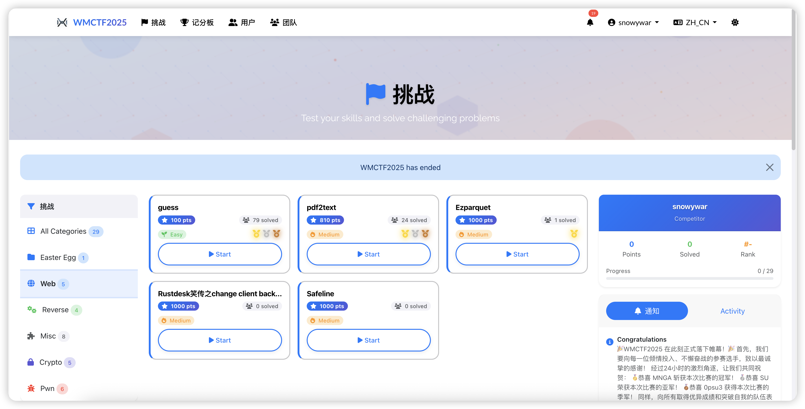
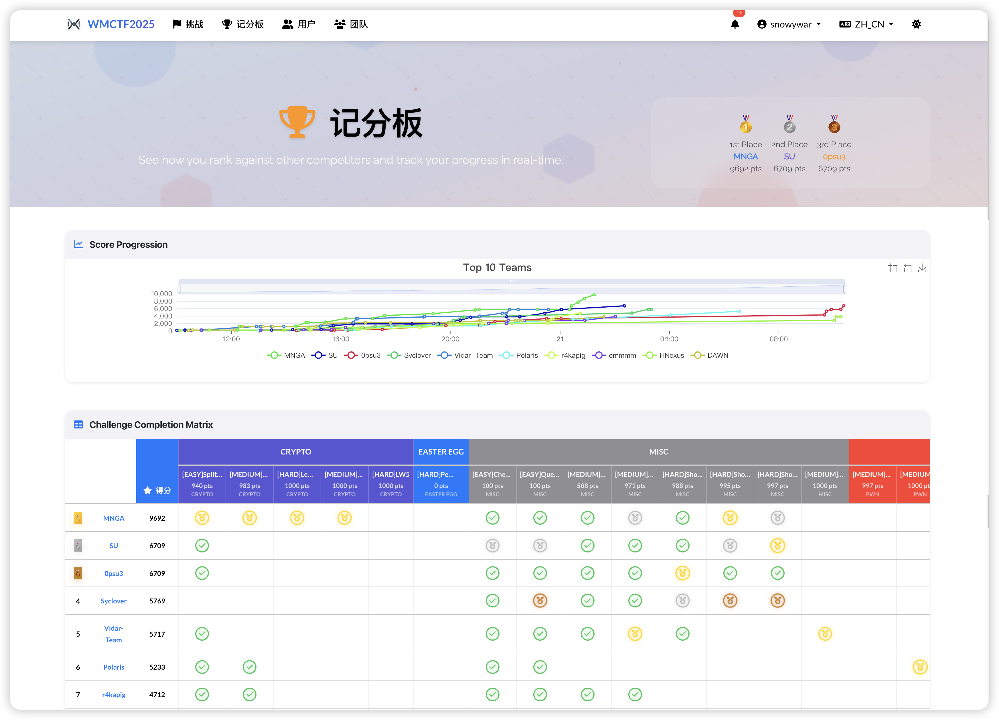
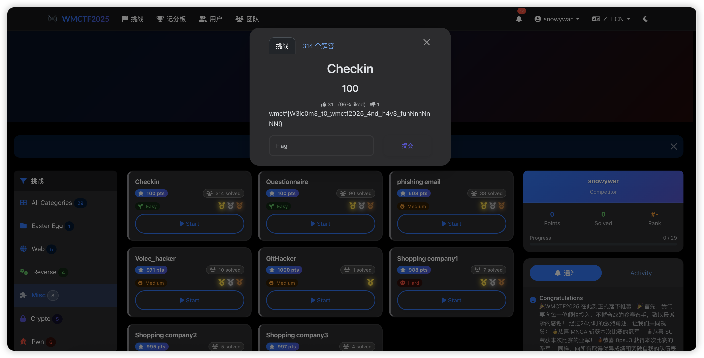

# WMCTF 现代主题

一个设计精美、现代化的CTFd主题，灵感来源于Apple Design设计原则，专为WMCTF竞赛量身定制。该主题采用当代扁平化设计，具有流畅的动画效果、出色的用户体验和完整的响应式支持。

> 🏆 **生产环境验证**: 该主题已在**WMCTF 2025**竞赛中成功部署和测试，网址为[wmctf.wm-team.cn](https://wmctf.wm-team.cn/)，为数百名参赛者提供了优秀的性能和用户体验。

## 📸 截图与演示

### 在线演示
🌐 **在线体验**: [WMCTF 2025 平台](https://wmctf.wm-team.cn/)

### 主题展示

#### 挑战页面
<!-- 在此添加挑战页面截图 -->

*精美的挑战卡片，配有难度指示器和流畅动画*

#### 积分榜
<!-- 在此添加积分榜截图 -->

*引人入胜的排行榜，配有排名徽章和进度可视化*

#### 深色模式支持
<!-- 在此添加深色模式截图 -->

*完整深色模式支持，支持自动主题切换*

## 🎨 设计特色

### 现代苹果风格设计
- **简洁极简**: 扁平化设计，配有精妙的阴影和渐变
- **字体设计**: 使用SF Pro Display和Inter字体，确保最佳可读性
- **色彩搭配**: 专业蓝色(#007AFF)、紫色(#5856D6)和强调色
- **间距布局**: 一致的苹果风格间距和比例

### 视觉增强
- **玻璃拟态**: 背景模糊效果，呈现现代美学
- **流畅动画**: 滑入、淡入和悬停效果
- **交互元素**: 具有精妙变换的悬停状态
- **自定义图标**: 与品牌一致的Font Awesome图标

### 用户体验
- **直观导航**: 现代下拉菜单和简洁布局
- **挑战卡片**: 精美的卡片式挑战展示，配有难度指示器
- **积分榜**: 引人入胜的排行榜，配有排名徽章和进度条
- **登录体验**: 居中的卡片式登录，配有渐变头部

## 🚀 主要改进

### 导航栏
- 玻璃拟态效果，配有背景模糊
- 精简的用户菜单，支持下拉
- 现代语言选择器
- 改进的移动端响应性

### 挑战页面
- **英雄区域**: 引人入胜的介绍，配有动画元素
- **卡片布局**: 现代挑战卡片，包含:
  - 难度指示器(简单/中等/困难)
  - 带渐变的分数徽章
  - 已解决状态指示器
  - 悬停动画和效果
- **分类标题**: 简洁的组织结构，配有统计信息

### 积分榜
- **排名显示**: 前3名位置的奖牌图标
- **进度可视化**: 进度条和分数显示
- **交互过滤器**: 现代药丸式分类过滤器
- **空状态**: 为新竞赛提供鼓励性消息

### 登录页面
- **居中设计**: 卡片式布局，配有渐变头部
- **品牌集成**: WMCTF标志和品牌元素
- **表单增强**: 圆角输入框，配有焦点效果
- **功能亮点**: 安全性、速度和竞赛图标

## 🛠 技术栈

### 前端技术
- **Bootstrap 5.3.3**: 现代CSS框架
- **Tailwind CSS 3.4.1**: 实用优先的CSS框架
- **Alpine.js 3.13.5**: 轻量级JavaScript框架
- **Vite 5.0.12**: 现代构建工具
- **SASS 1.70.0**: CSS预处理器

### 字体与图标
- **SF Pro Display**: 苹果系统字体
- **Inter**: 现代几何无衬线字体
- **Font Awesome 6.5.1**: 全面的图标库

### 构建流程
- **PostCSS**: CSS处理，配有autoprefixer
- **Vite**: 快速开发和优化的生产构建
- **资源管道**: 自动字体和图像复制

## 📱 响应式设计

### 断点
- **移动优先**: 针对移动设备优化
- **平板**: 为中等屏幕增强布局
- **桌面**: 为大屏幕提供完整功能体验

### 移动端优化
- 触控友好的按钮和导航
- 优化的卡片布局
- 可折叠导航菜单
- 减少动画复杂性

## 🎯 品牌标识

### WMCTF品牌
- **标志**: 自定义SVG标志，配有电路图案
- **色彩**: 品牌一致的配色方案
- **字体**: 专业且易读的字体选择
- **图像**: 自定义英雄背景和图形

### 视觉层次
- 清晰的内容组织
- 一致的间距和对齐
- 适当的对比度比例
- 无障碍的色彩组合

## 🔧 安装与开发

### 前置要求
- Node.js 16+ 和 Yarn包管理器
- 用于测试的CTFd实例

### 开发设置
1. **安装依赖**:
   ```bash
   yarn install
   ```

2. **开发模式**:
   ```bash
   yarn dev
   ```
   这将运行Vite监视模式以实现实时重载。

3. **生产构建**:
   ```bash
   yarn build
   ```
   在`static`文件夹中生成优化的资源。

### 文件结构
```
assets/
├── img/              # 图像和SVG资源
├── js/               # JavaScript模块
├── scss/             # SASS样式表
│   ├── main.scss     # 主样式表
│   └── includes/     # 组件样式
templates/            # Jinja2模板
├── base.html         # 基础模板
├── challenges.html   # 挑战列表
├── login.html        # 登录页面
├── scoreboard.html   # 积分榜
└── components/       # 可重用组件
static/               # 编译资源(生成的)
```

## 🎨 自定义

### 配色方案
主题使用CSS自定义属性，便于自定义:
```css
:root {
  --wmctf-primary: #007AFF;    /* 苹果蓝 */
  --wmctf-secondary: #5856D6;  /* 苹果紫 */
  --wmctf-accent: #FF3B30;     /* 苹果红 */
  --wmctf-success: #34C759;    /* 苹果绿 */
  --wmctf-warning: #FF9500;    /* 苹果橙 */
}
```

### 深色模式
完整深色模式支持，支持自动主题切换:
- 深色变量
- 调整对比度比例
- 一致的组件样式

## 🚀 性能特性

### 优化
- **懒加载**: 渐进式内容加载
- **资源优化**: 压缩的CSS和JavaScript
- **字体加载**: 优化的网络字体传输
- **图像优化**: 可扩展的SVG图形

### 浏览器支持
- 现代浏览器(Chrome、Firefox、Safari、Edge)
- 对旧浏览器的渐进增强
- CSS Grid和Flexbox布局
- CSS自定义属性

## 📄 许可证

该项目采用 Apache License 2.0 许可证。详情请参阅 [LICENSE](LICENSE) 文件。

## 🎉 生产环境成功案例

**WMCTF 2025成就**: 该主题已在真实世界的WMCTF 2025竞赛中成功部署并经过实战测试:

- 🌐 **在线平台**: [wmctf.wm-team.cn](https://wmctf.wm-team.cn/)
- 👥 **参赛者**: 成功为数百名CTF参赛者提供服务
- ⚡ **性能**: 出色的加载速度和响应式设计
- 🔧 **稳定性**: 竞赛期间零重大问题
- 📱 **跨平台**: 在所有设备和浏览器上完美兼容
- 🎯 **用户体验**: 因其现代化设计和直观界面获得参赛者积极反馈

该主题在高风险竞赛环境中证明了其可靠性、性能和用户友好性，使其成为CTF平台的可信选择。

---

**用❤️为WMCTF创造** - 一个现代化、美观且用户友好的CTF平台体验，已在生产环境中得到验证。
